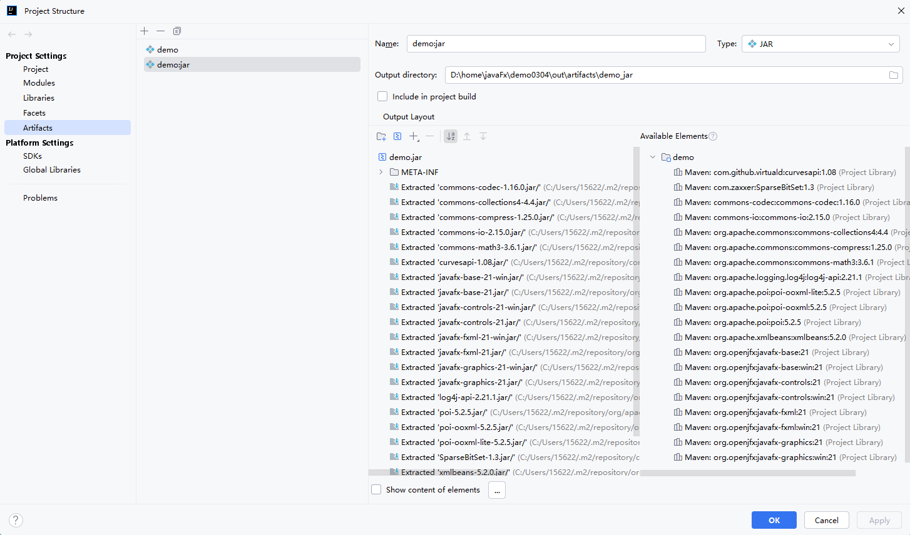

## 运行指令
```
./mvnw clean javafx:run
```

## 生成app指令
```
./mvnw clean javafx:jlink --add-modules ALL-MODULE-PATH 
```

## 打包指令
```
jlink --add-modules ALL-MODULE-PATH --module-path D:\home\javaFx\demo\target\demo-1.0-SNAPSHOT.jar --output D:\home\javaFx\demo\app --launcher myapp=com.example.demo.HelloApplication

jlink --add-modules D:\home\javaFx\demo\poi-jar\poi-5.2.3.jar --module-path D:\home\javaFx\demo\target\demo-1.0-SNAPSHOT.jar --output D:\home\javaFx\demo\app --launcher myapp=com.example.demo.HelloApplication


jpackage --name test --type app-word -m com.example.demo.HelloApplication --runtime

jpackage --input target --main-jar demo-1.0-SNAPSHOT.jar --main-class com.example.demo.HelloApplication `
--add-modules ALL-MODULE-PATH `
--name MyApp --dest output --type exe
```

## jar命令
```
java -jar demo-1.0-SNAPSHOT.jar  

java --module-path C:\java\javafx-sdk-21.0.6\lib --add-modules javafx.controls,javafx.fxml -jar demo.jar

javac --module-path C:\java\javafx-sdk-21.0.6\lib --add-modules javafx.controls,javafx.fxml -d out $(find src -name "*.java")

jdeps --multi-release 21 --ignore-missing-deps --generate-module-info . *.jar

jdeps --multi-release 21 --ignore-missing-deps --generate-module-info jars . *.jar

javac --patch-module commons.math3=commons-math3-3.6.1.jar D:\home\javaFx\untitled2\commons.math3\versions\21\module-info.java

jar uf commons-math3-3.6.1.jar -C D:\home\javaFx\untitled2\commons.math3\versions\21\module-info.class

```

## build jar包
```
    
    
```